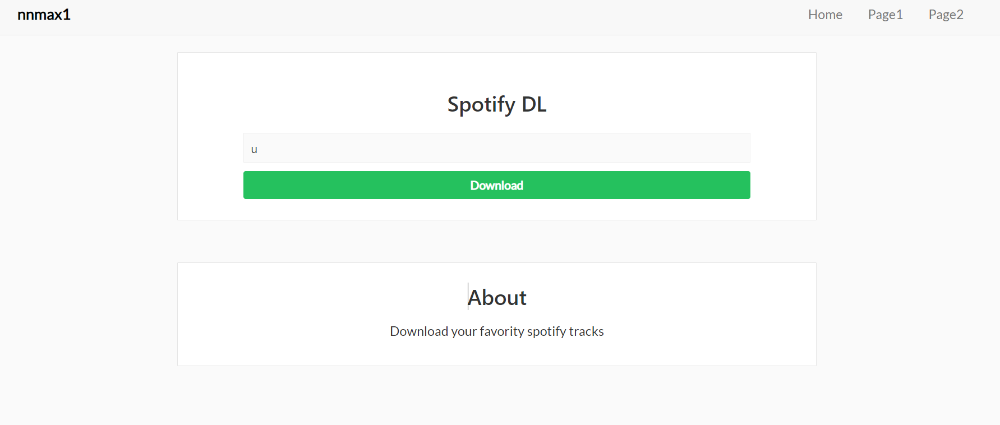

# Spotify Downloader 

 
 
<h1>About: </h1>

 Simple web app to download your favorite spotify tracks 

<h1>How to: </h1>

 
Step 1. You need to get credentials to use Spotify Web API.  
https://developer.spotify.com/documentation/web-api/
 
Step 2. Copy and paste your credentials to the C_ID and C_SECRET variables in main.py 
 
Step 3. install python3 dependencies (you also need ffmpeg for youtube-dl)
<pre>
pip install -r requirements.txt
</pre>
Step 4. Run flask application (will run on port 5000)
<pre>flask run</pre>

